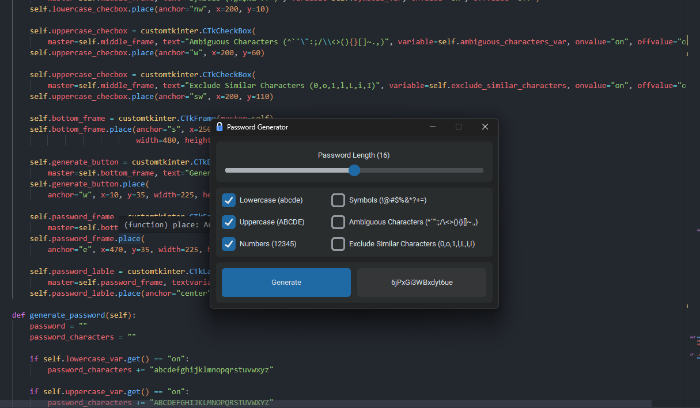

# Password Generator GUI

A random password generator made with customtkinter.



## Python Version

This project was developed using Python 3.12.0.

## Install Dependencies

Install the necessary dependencies.

```text
pip install -r requirements.txt
```

## Contributing

Pull requests are welcome. For major changes, please open an issue first to discuss what you would like to change. If your pull request is ignored, try KrakenDec's fork.
